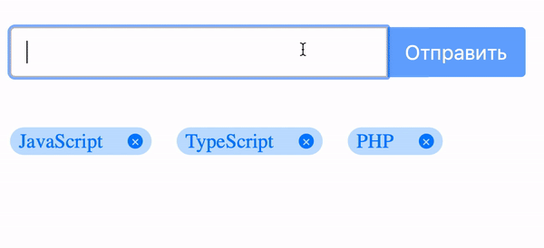

Добавление тегов
===

## Задача

Необходимо реализовать компонент - форма для добавления тегов.  
Внешний вид должен быть максимально похож на компонент из примера

## Состояние (стейт)

Теги должны храниться в стейте в виде массива. Любое добавление или удаление тегов – это 
добавление или удаление элементов из этого массива. 
Однако, помни, что изменять стейт напрямую нельзя.

## Форма

* Если поле ввода (input) остается пустым после потери фокуса, оно получает класс `is-error`, и пользователю показывается сообщение с текстом
  "Поле ввода не должно быть пустым". Класс `is-error` должен быть оформлен таким образом, чтобы поле ввода подсвечивалось красным цветом.
* Если поле пустое, кнопка отправки не должна быть активной;
* При вводе текста в поле, кнопка становится активной, а сообщение и класс `is-error` пропадают;
